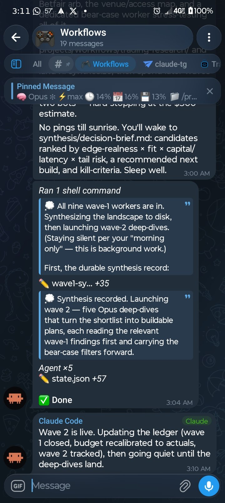

## cc-bridge

Drive **Claude Code or OpenAI Codex CLI** from Telegram. Each chat/topic keeps its own terminal-agent identity, so Claude and Codex sessions can run side by side and resume with the correct CLI.

<p align="center">
  
</p>

## Requirements

- [Claude Code](https://claude.com/claude-code) installed and logged in.
- Optional: [OpenAI Codex CLI](https://github.com/openai/codex) installed and authenticated with ChatGPT. Set `CODEX_BIN=/absolute/path/to/codex` in the bridge `.env` if `codex` is not the correct executable on the daemon's `PATH`. On Linux, Codex's `workspace-write` sandbox also needs Bubblewrap and user/network namespace support; the setup wizard probes this and offers Ubuntu's official AppArmor-profile repair when needed. `tg doctor` reports CLI, login, sandbox, and failover readiness.
- Optional: [claude-code-proxy](https://github.com/raine/claude-code-proxy) to run Codex, Kimi, Grok, or Cursor **inside the Claude Code harness**. Authenticate the provider once (for example, `claude-code-proxy codex auth device`). The bridge starts the loopback proxy on demand. Override its executable or URL with `CLAUDE_CODE_PROXY_BIN` / `CLAUDE_CODE_PROXY_URL` in the bridge `.env`.
- [Bun](https://bun.sh) (the runtime; dependencies install on first launch).
- A Telegram bot token from [@BotFather](https://t.me/BotFather).
- `tmux` — required for some features. Core messaging works without it via MCP.
- Linux or macOS (on Windows, run inside [WSL2](https://learn.microsoft.com/windows/wsl/) — native Windows has no `tmux`).

## Installation: 

Start Claude in a tmux session, drop the link to this repo and tell Claude "install this here." It will walk you through installation and download any dependencies if missing.

## Launch

The installer adds the alias claude-tg, which runs Claude with the identifier for the daemon to pick up the session. After going through the initial install, run the alias inside a tmux session, then send a message to the Telegram bot.

For multi-session, add the Telegram bot as an admin with full rights in a Telegram group with topics enabled and send /bind in the general chat. Every new topic you make then opens a new session and lets you specify where it runs. Set your projects root with `/base <path>` after binding — new topics nest under it.

## Usage

Send text, media, slash commands, and voice messages through Telegram. In multi-session mode, adding new group topics starts a new session, deleting a topic closes that session. 

Use `/agent` to see the current terminal agent. `/agent claude` or `/agent codex` starts that CLI; in forum-topic mode they can run side by side. Existing topics remember their agent across restart and resume.

Use `/harness` in a Claude Code topic to keep Claude Code's TUI, tools, skills, permissions, and transcript while changing only inference. Examples: `/harness codex`, `/harness codex gpt-5.6-terra`, `/harness kimi`, `/harness grok`, `/harness cursor`, and `/harness native` to return to Anthropic. The conversation is resumed in place and the choice persists with the topic. This is distinct from `/agent codex`, which runs the standalone Codex CLI.

For any other Anthropic Messages-compatible provider, add a gateway straight from Telegram — no file editing, no restart. Open `/settings` → 🔀 Limit failover → **➕ 🌐 Gateway** and pick a provider: **MiniMax**, **DeepSeek**, and **Z.ai (GLM)** are built-in presets (base URL + a current model pre-filled — you only enter the API key), or choose **Custom** and reply with `name baseUrl model` for any other endpoint (auth defaults to `x-api-key`; append `bearer` or `none`). The API key is written to `.env` and your key message is deleted from the chat; a one-token Anthropic Messages preflight verifies it. The gateway is then usable live with `/harness gateway <name> [model]` **and** becomes a reorderable hop in your failover chain — when a Claude subscription hits its usage limit, the session falls over to it (same transcript, resumed in place, inference served by the gateway). Reorder the chain with the ↑/↓ arrows; remove a gateway with the 🗑 next to it.

The store is still a plain file at `~/.claude/channels/telegram/harness-gateways.json` (read live, so hand-edits also need no restart), with secrets in the bridge `.env` under the `CC_BRIDGE_GATEWAY_*` namespace:

```json
{
  "minimax": {
    "baseUrl": "https://api.minimax.io/anthropic",
    "auth": "x-api-key",
    "tokenEnv": "CC_BRIDGE_GATEWAY_MINIMAX_KEY",
    "model": "MiniMax-M3",
    "smallModel": "MiniMax-M2.7-highspeed"
  },
  "local": {
    "baseUrl": "http://127.0.0.1:11434/anthropic",
    "auth": "none",
    "model": "qwen3-coder",
    "smallModel": "qwen3-coder-fast"
  }
}
```

Supported auth modes are `bearer`, `x-api-key`, and `none`. Remote gateways must use HTTPS; plain HTTP is accepted only on loopback. Secrets never enter topic, pane, command-line, or conversation metadata. Generic-gateway Claude processes receive a minimal allowlisted environment rather than unrelated bridge credentials. A tiny one-token Anthropic Messages preflight verifies endpoint, authentication, model, and response shape before the running Claude session is disrupted.

These commands are added by the bridge. Everything else belongs to the active terminal CLI — see below.

| Command | What it does |
| --- | --- |
| `/start` | Welcome + full feature guide (and pairing steps if not paired) |
| `/agent [claude|codex]` | Show or start the terminal CLI for this chat/topic |
| `/harness [provider] [model]` | Keep Claude Code but use native, a built-in subscription proxy, or any configured Anthropic-compatible gateway |
| `/stop` | Interrupt the current task — sends Esc (alias `/esc`) |
| `/cancel` | Clear a stuck force-reply prompt (e.g. an unanswered "name a folder") |
| `/back` | Get a stuck session — an editor, a pager, or an unrecognized screen — back to the Claude prompt |
| `/restart` | Restart & resume the session (`/restart all` for every active session) |
| `/resume` | List recent sessions with last-activity times; tap one to relaunch |
| `/new` | Start a fresh conversation in the session |
| `/files` | Browse, download, and edit files in the session's folder (web Mini App) |
| `/find <text>` | Search every session's conversation; tap a hit to resume |
| `/cron <when>` | Schedule a message for later (`/cron 12h` · `every 09:00` · `cancel`; alias `/schedule`) |
| `/queue <prompt>` | Per-session backlog — runs when the session goes idle (`/queue clear`) |
| `/terminal` | Show recent terminal activity (40 lines) |
| `/md` | Create a `.md` file in the working dir, then reply with its contents |
| `/budget` | Daily $ cap with 80%/100% warnings (`/budget 20` · `off`) |
| `/account` | Claude accounts — list, `add <name>`, `remove <name>` (multi-account) |
| `/status` | Re-post the pinned status card at the bottom (`/pin` toggles it) |
| `/health` | Bridge vitals — instance, uptime, panes, queues, watchdog |
| `/stream` | Live-activity card style: `thoughts` · `actions` · `off` |
| `/voice` | Voice-note replies on/off |
| `/settings` | Channel settings panel — Claude.ai accounts, GitHub accounts, voice transcription, and more |
| `/update` | Update menu with a button for each — `/update tg` updates the bridge, `/update claude` updates Claude itself |
| `/handoff` | Prepare a session handoff — run tests, commit done work, update `PLAN.md`/`DECISIONS.md`, write `HANDOFF.md`, audit plan vs repo (all git-ignored) |
| `/continue` | Resume work — read `PLAN.md`/`DECISIONS.md`/`HANDOFF.md`/`CLAUDE.md`, run the Verify-state checks, then start the current task |
| `/audit` | Audit the repo against `PLAN.md` (subagent) and reconcile task statuses |

**Mode shortcuts:** On Claude, `/mode` opens the permission-mode switcher and `/plan` `/auto` `/default` `/acceptedits` `/bypass` jump straight to one. On Codex, `/mode` opens native `/permissions`; `/model` and `/effort` open Codex's combined model/reasoning picker.

**Everything else goes to the active CLI.** Common mappings include `/new`/`/clear` → Codex `/new`, `/rewind` → Codex `/fork`, and `/compact` → native `/compact`. Unhandled slash commands are relayed directly, so Codex commands such as `/review`, `/status`, `/usage`, `/skills`, `/mcp`, `/plugins`, `/hooks`, `/theme`, and `/experimental` remain available. Bridge `/context` reads Codex rollout tokens; Codex does not expose Claude-style dollar cost.


## Also: Slack & Discord

The same marketplace ships two sibling bridges — **[claude-slack](plugins/claude-slack/)** and
**[claude-discord](plugins/claude-discord/)** — that drive a Claude Code session from those
platforms with the same model: inbound text/files typed into the session's tmux pane, replies read
from the transcript, permission prompts as tap-to-approve buttons. They're independently versioned
plugins in the one `cc-bridge` marketplace, each with its own state dir and daemon; the same
`claude-tg` launcher (the `@tg_bridge` pane marker) drives every channel.

MVP surface today: two-way chat, file send/receive, permission/reaction controls, allowlist access.
Panels, schedulers, and voice remain Telegram-only. To set one up, point Claude at
`plugins/claude-slack/INSTALL.md` or `plugins/claude-discord/INSTALL.md` (agent-executable, like the
Telegram install).

## Upgrading

Just run `/update tg` from inside the bot to update the bridge. Bonus: `/update claude` updates Claude itself, and bare `/update` opens a menu with a button for each.

## Uninstalling

Run `/telegram:configure uninstall` for a guided teardown.


## License

MIT — see [`LICENSE`](./LICENSE).
